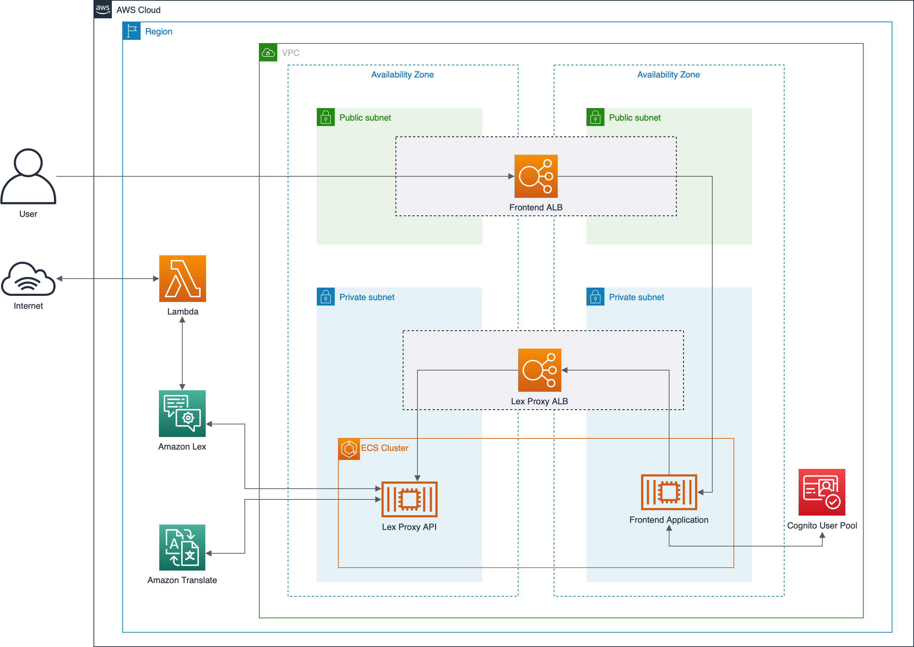

# lex-translate-demo

The purpose of this demonstration is show how we can use [Amazon Translate](https://aws.amazon.com/translate/) to add more languages support for [Amazon Lex](https://aws.amazon.com/lex/).

# Architecture Diagram

 

> The main focus of this demonstration is show the integration of Amazon Translate and Lex, is this case we are using **Lex Proxy API** to integrate these services.